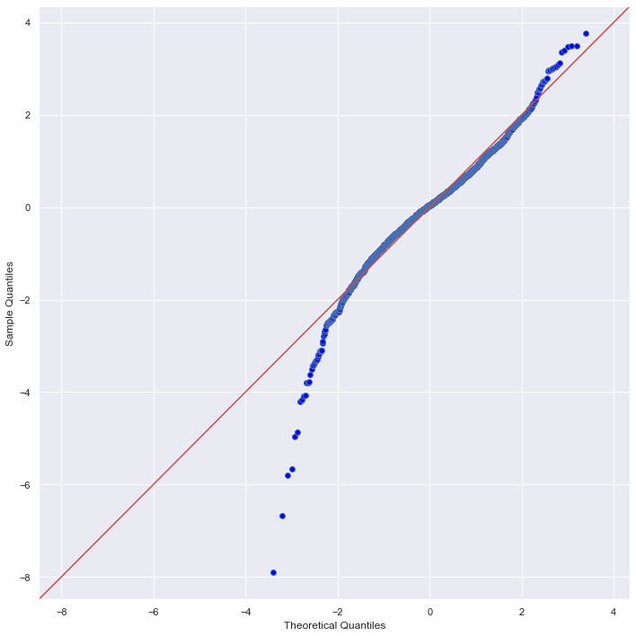
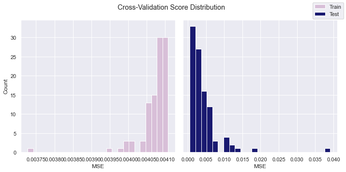

# WHO Life Expectancy Multiple Linear Regression Analysis

**Author:** Ngoc Ho

**Overview**

Previously there were many studies on linear regression model to predict life expectancy however in most of them, affect of immunization and human development index was not taken into account. This project aims to build a regression model to predict life expectancy and investigate which factors affect life expectancy in the world with data of immunisation and human development included. A country can use this model to predict life expectancy and determine the predicting factor which is contributing to lower value of life expectancy. This will help in suggesting a country which area should be given importance in order to efficiently improve the life expectancy of its population.This model will be devrived from WHO life expectancy with data from every countries between 2000-2015 using statsmodel library in Python. From our model we found 9 significant factors contributing to life expectancy and the model is able to predict life expectancy to high level of accuracy.

**Business Problem**

Life Expectancy is affected by various factors. WHO wishes to predict life expectancy and determine which factors has significant impact. From this project, WHO would be able to give a country its life expectancy and suggestions on which factor to focus on to improve their life expectancy.

Questions to consider:

Does various predicting factors which has been chosen initially really affect the Life expectancy? What are the predicting variables actually affecting the life expectancy
What is the impact of Immunization coverage on life Expectancy?
Do densely populated countries tend to have lower life expectancy?
What is the impact of schooling on the lifespan of humans?

**Data:**
The dataset related to life expectancy, health factors for 193 countries has been collected from the same WHO data repository website and its corresponding economic data was collected from United Nation website. The data set has 22 columns and 2938 entries. Out of 22 colums, 20 predicting factors (independent variables). Our dependent variable is life expectancy in years. We will examine the relationship of these factors and life expectancy value using correlation analysis. These features will also be used to investigate their effect on life expectancy and be selected to be included in a multilinear regression model to predict life expectancy value.

**Method:**

Check for data completeness and integrity

Perform EDA with statistical analysis to determine statistically significant features

Visualize statistically significant features

Engineer new features based on stastistical findings

Model Linear Regression models and evaluate each model using residual plots (check homoscedasticity) and QQ plots (check normality) for final implementation

- Baseline model ( no changes to features)
Adj-R2 : 0.819, RMSE : -0.922, Residual error: 15-16 years
Very high residual errors suggesting our model is poor.

- Model 1: Significant features are selected and multicollinearity removed
Adj-R2 : 0.8, RMSE : -0.18, Redisual error : 17-18 years
Slightly better RMSE but large redidual errors 
QQ-plot of residuals suggests violation of normality assumption

- Model 2: Normalisation of all variables using log transformation
Adj_R2: 0.804, RMSE: 1.411e-05 Residual error: 0.004

Our model significantly improve after log transformation to make variables distribution more normal. Our residual errors showed significant improvement. 

- Final model: Features scalling using standardisation
Adj_R2: 0.804, RMSE: -0.0005, Residual: 0.037

RSME is a perfect result showing that our model is not overfit or underfit and it yields accurate results.
QQ-plot seems more non-linear over each iteration of the model and Jarque-Bera score has reduced from 177 to 2.7 suggesting more normality. Our residual plots also shows more homocesdascity however our QQplot and Breush-Pagan Test indicated homoskadasticity violation.

Evaluate final model using cross validation

**Evaluations:**
The final model is able to produce almost zero residual both in the test and train group which means that within linear regression this model is very accurate. With a neglegible RMSE value close to 0, this model does not seem to be underfit or overfit. It has reasonable ability to generalise beyond the dataset. Jarque-Bera score improved from 389.55 in baseline model to 2.7 in final model, indicating improvement in normality. However our QQ-plot showed non-linear relationship and also our Breusch-Pagan Lagrange Multiplier test for heteroscedasticity recomfirmed heteroskedasticity. On the other hand, our residual plots of the model also shows ok homocesdascity in some variables. Our adjusted R2 value is only 0.804 which means that this model can explain 80.4% changes in the dependent variable i.e the features in this multilinear regression model can explain 80.4% of the variance in life expectancy. This adjusted R2 value indicates that linear regression is a very good fit for this dataset. I am confident that this model can accurate predict property value based on RSME results from cross validation and the model has strong inference abilty given the high adjusted R2 value. Therefore, this model maybe useful in accurately predicting life expectancy values and accurately explain how each features will affect life expectancy. However our linear regression model failed to satisfy the homoskedasticity assumption which questions the suitability of linear regression model.

**Conclusions**
From our final model summary, the estimated value of the coefficient indicates how strongly each factors affect life expectancy. We found 9 significant factors that affect life expectancy. They are Adult Mortality, BMI, Polio, Diphtheria, HIV_AIDS, GDP, thinness_1_19yrs, Schooling, status_Developing. HIV/AIDS has the highest estimated value of coefficient meaning this factor affects negatively affect life expectancy the most. We also found that Polio and Diphtheria immunisation does have positive effect on life expectancy. Population does not have an effect on life expectancy as it was eliminated in the stepwise selection process and it has p-value 0.972 and a significantly low correlation coefficient with life expectancy. We found that the number of years of schooling does have a postive correlation relationship and is a significant factor in life expectancy value. From this model, countries with high HIV/AIDS rate should focus on lowering it and increase their Polio, Diphtheria immunisation rate and invest in education. Countries should pay attention to all 9 factors affecting life expetancy.

**Limitations:**

This data set only includes data from 2000-2015 perhaps more updated dataset would provide a more accurate of current life expectancy. 

Our linear regression model did not satisfy the homoceskedasticity assumptions perhaps a non-linear model is a more suitable model for this dataset. 

## For More Information

Please review my full analysis in [my Jupyter Notebook](https://github.com/NBYHO/dsc-project-2-house-sales/blob/main/King_County_Housing_Model.ipynb) or my [presentation](https://github.com/NBYHO/dsc-project-2-house-sales/blob/main/King%20County%20Presentation.pdf).

For any additional questions, please contact **Ngoc Ho, yen.ho993@gmail.com**

## Repository Structure
    .
    ├── data                                # data folder
    ├── images                              # project image/graph files
    ├── King_County_Housing_Model.ipynb     # project notebook
    ├── Presentation.pdf                    # project presentation
    └── README.md

